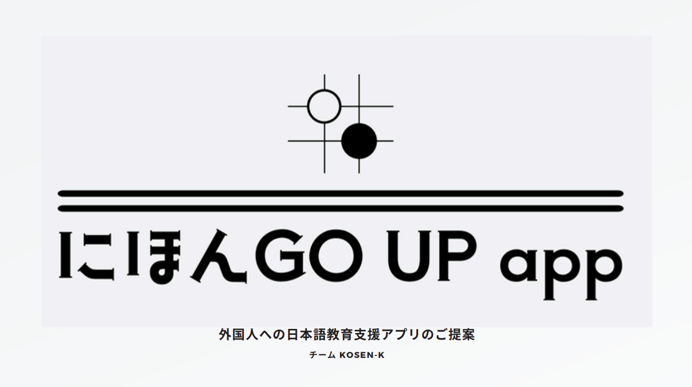
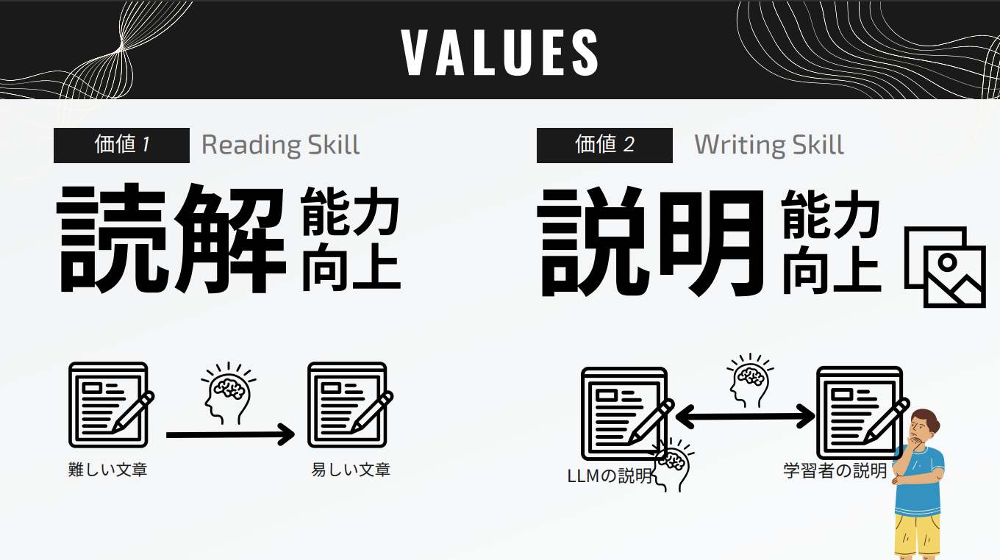
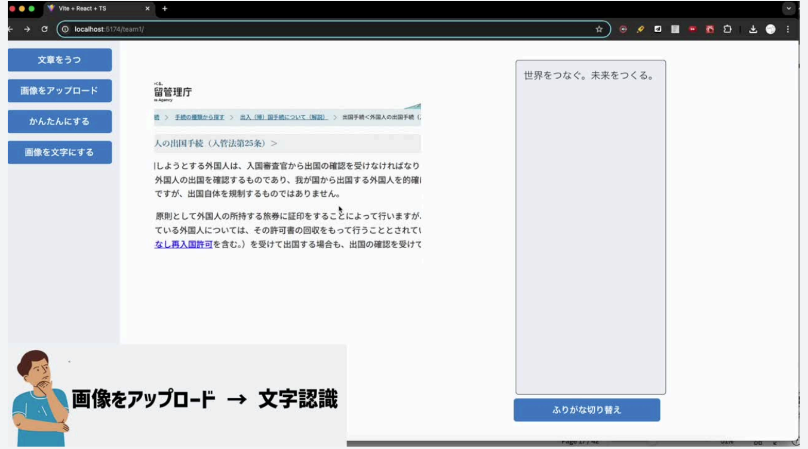
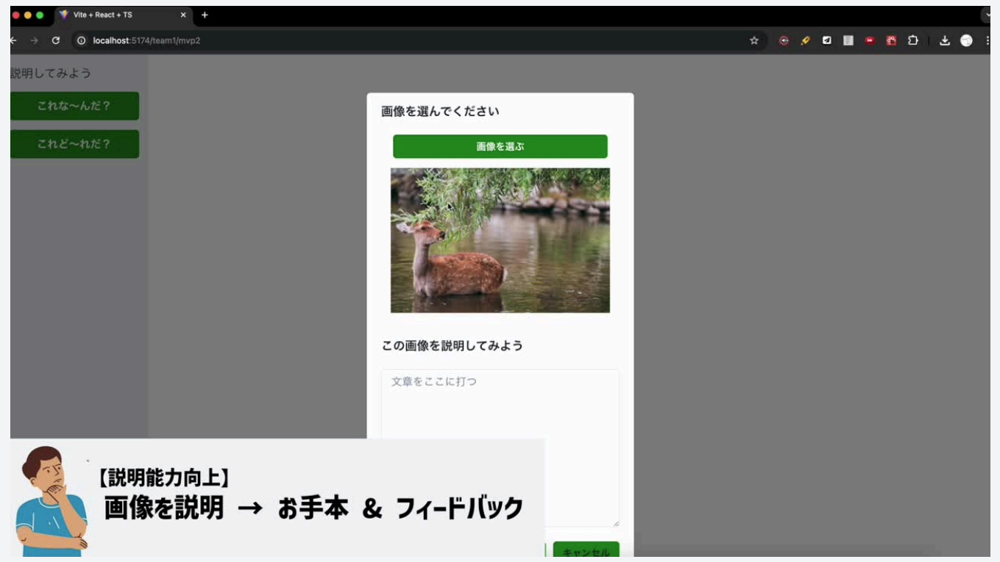
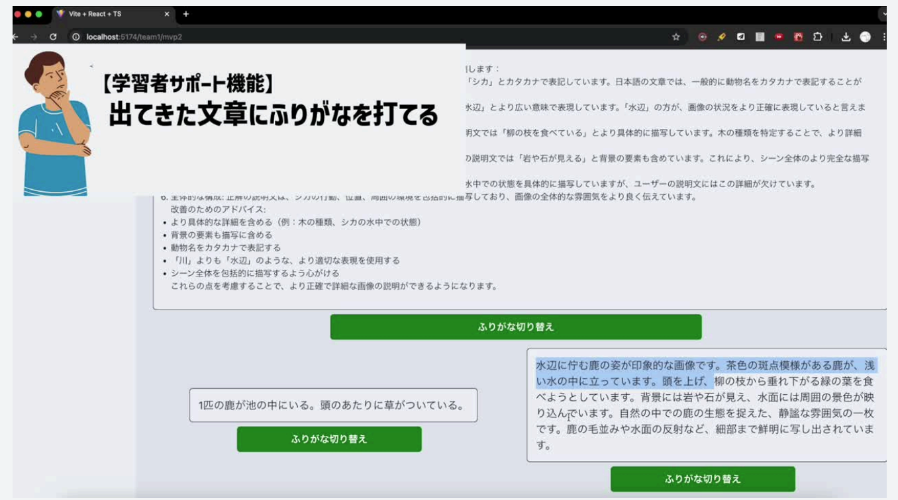
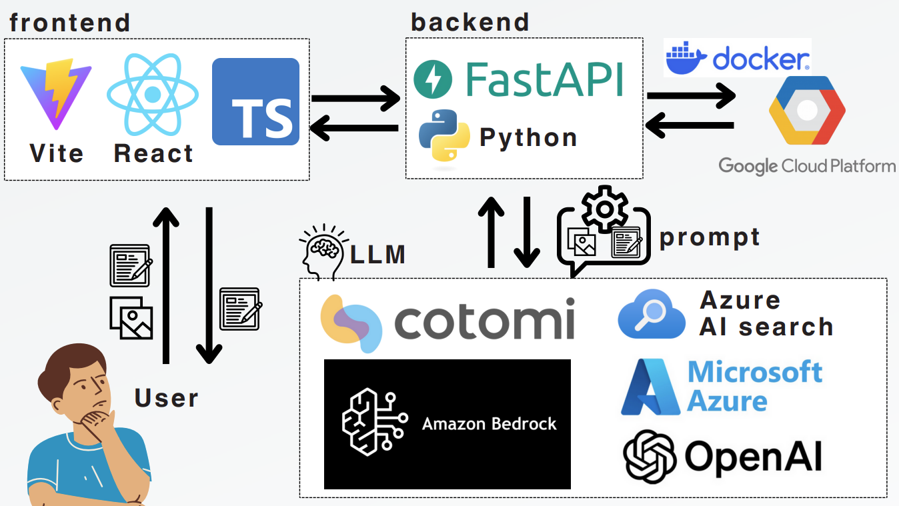
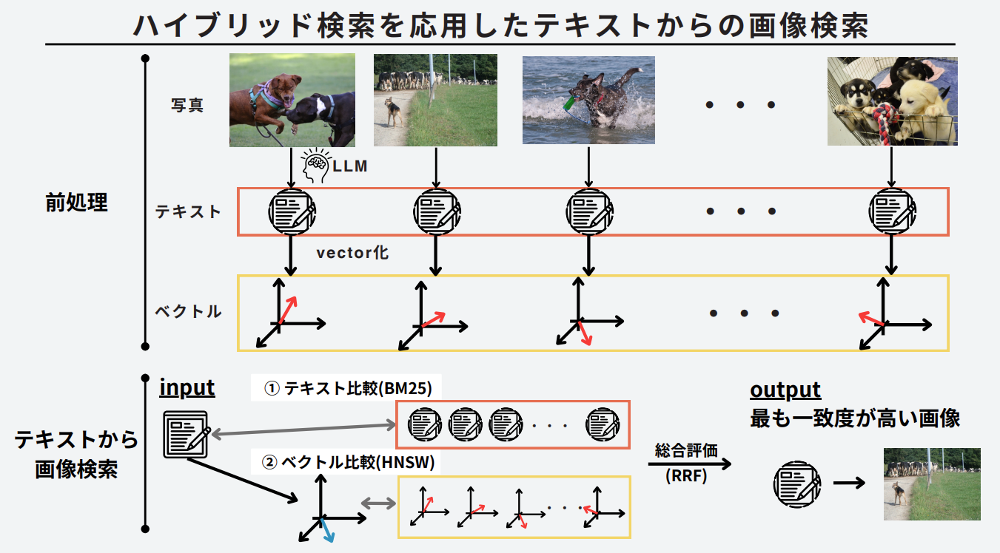

# にほんGO UP App

UMP-JUST主催の「生成AIハッカソン」での作品です．backendを担当しました．

<p align="center">
    
</p>

## 環境構築
1. 以下のサービスに登録してAPIキーを取得
    - Cotomi API
    - AWS Bedrock
    - Azure AI search
2. backend: `back/`直下に`.env`を作成
    - 実行に必要なのはCotomi関連の3つ，AWS関連の4つ，Azure AI Search関連の2つのAPIキー．
    - それ以外は空白でOK．
    ```
    COTOMI_API_KEY=
    COTOMI_BASE_URL=
    COTOMI_MODEL=

    AWS_USERNAME=
    AWS_PASSWORD=
    AWS_CONSOLE_SITE=

    AWS_ACCESS_KEY_ID=
    AWS_SECRET_ACCESS_KEY=

    AZURE_OPENAI_VERSION=
    AZURE_OPENAI_MODEL=
    AZURE_OPENAI_ENDPOINT=
    AZURE_OPENAI_API_KEY=

    AZURE_AI_SEARCH_ENDPOINT=
    AZURE_AI_SEARCH_API_KEY=

    AZURE_EMBEDDING_MODELNAME=
    AZURE_EMBEDDING_API_KEY=
    ```
3. backend: `back/`で以下のコマンドを実行
    ```
    poetry install
    ```
4. backend: `back/`で以下のコマンドを実行
    ```
    poetry run uvicorn app.routes.main:app
    ```
5. frontend: `front/`で以下のコマンドを実行
    ```
    npm install
    npm run serve
    ```
6. ブラウザで`http://localhost:8080/`にアクセス


## 作品の概要
<p align="center">
    
    
    
    
    
    
</p>
